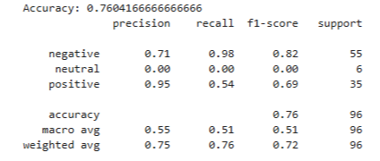
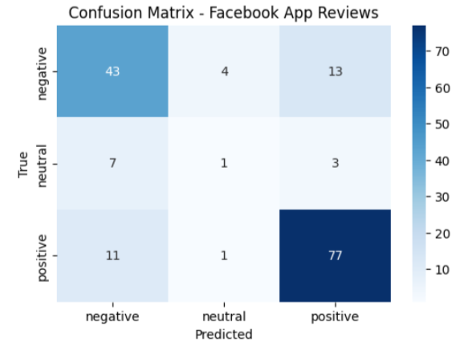
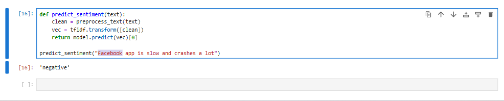

# Emotion Detection from Social Media Reviews using NLP & Machine Learning

## 📌 Project Overview
This project was developed as part of my Final Year Project (PFE).  
The objective is to build a Machine Learning system capable of automatically detecting user emotions from online application reviews collected through web scraping techniques.

The system analyzes real user feedback and classifies sentiments into:

- Positive 🙂
- Neutral 😐
- Negative 🙁

This project demonstrates a complete Data Science pipeline from data collection to model evaluation.

---

## 🎯 Objectives
- Collect real-world user reviews using web scraping
- Preprocess textual data using NLP techniques
- Transform text into numerical features
- Train a Machine Learning model for sentiment classification
- Evaluate model performance

---

## 🧠 Methodology

### 1️⃣ Data Collection
Reviews were collected using web scraping from:
- Amazon
- Facebook

### 2️⃣ Data Preprocessing
- Text cleaning
- Lowercasing
- Removing punctuation
- Stopwords removal
- Tokenization

### 3️⃣ Feature Engineering
TF-IDF Vectorization was applied to convert text into numerical representations.

### 4️⃣ Model Training
A Logistic Regression model was trained to classify sentiment labels.

### 5️⃣ Evaluation
Performance was evaluated using accuracy score and confusion matrix.

---

## 🛠️ Technologies Used
- Python
- NLP (NLTK)
- Scikit-learn
- Pandas
- Machine Learning
- Web Scraping

---

## 📊 Results

### ✅ Model Accuracy
```
Accuracy: 0.76
```


### 📈 Confusion Matrix


### 🔎 Model Prediction Example


The model successfully predicts user sentiment from real-world reviews with good performance.

---

## 📂 Project Structure

```
emotion-detection-from-reviews/
│
├── data/
│   ├── all_reviews_facebook_data.csv
│   └── amazon_google_play_reviews.csv
│
├── src/
│   ├── amazon_data_scraping.py
│   └── facebook_data_scraping.py
│
├── notebooks/
│   ├── amazon_data_scraping_1.ipynb
│   ├── amazon_data_scraping_2.ipynb
│   └── facebook_data_scraping.ipynb
│
├── results/
│   ├── confusion_matrix_facebook.png
│   ├── model_prediction_example_facebook.png
│   └── training_accuracy_facebook.png
│
├── requirements.txt
├── README.md
└── .gitignore
```

---

## ⚙️ Installation & Usage

### Clone repository
```bash
git clone https://github.com/redasalimi/emotion-detection-nlp-pfe.git
```

### Install dependencies
```bash
pip install -r requirements.txt
```

### Run scripts
```bash
python src/amazon_data_scraping.py
python src/facebook_data_scraping.py
```

---

## 👨‍🎓 Academic Context
Final Year Project (PFE)

Supervisor: Sara Rabiai
Role: Jury Member

---

## 🚀 Future Improvements
- Deep Learning models (LSTM / Transformers)
- Real-time sentiment API
- Web interface dashboard

---

## 📬 Author
**Reda Salimi**

LinkedIn: https://www.linkedin.com/in/reda-salimi-82ab412ba
GitHub:  https://github.com/redasalimi

---

⭐ If you find this project useful, feel free to star the repository!